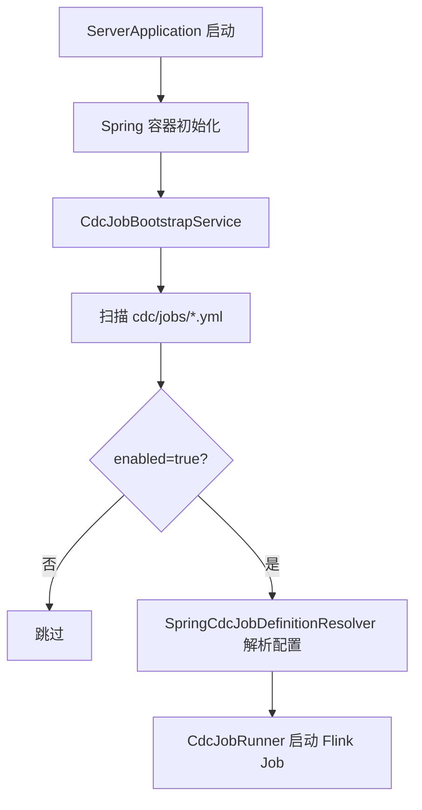

# Flick CDC 项目说明书

> 面向对象：开发同学、运维同学、刚接手项目的新同学
> 更新日期：2026-04-17
> 文档状态：当前有效（以本文为准）

## 1. 这套项目到底在做什么

一句话：它是一个跑在 Spring Boot 里的 CDC 任务容器，用 Flink CDC 监听 MySQL 变更，再把业务宽表写到 Elasticsearch。

再说直白点：
- MySQL 有数据变化（新增/更新）
- 项目拿到变更主键 ID
- 按配置的 SQL 回库查完整数据
- 按配置写入 ES 索引

这套方案的重点不是“写死某一张表”，而是“配置驱动”。
也就是新增同步任务时，优先改 `YAML + SQL + Mapping`，尽量不改 Java 代码。

## 2. 整体构思（为什么这么设计）

这个项目是为了解决两个现实问题：
- 业务查询越来越重，MySQL 不适合直接扛复杂检索
- 每新增一张同步表都写一套代码，维护成本太高

所以现在的思路是：
- 应用负责统一启动、配置装配、任务托管
- CDC 任务负责监听变更和数据搬运
- 任务定义靠资源文件管理，做到“可复制、可扩展、可回滚”

## 3. 技术架构

### 3.1 启动架构



### 3.2 数据链路架构


### 3.3 当前行为边界

- 监听操作：`INSERT`、`UPDATE`（由 `listenOps` 控制）
- `DELETE`：当前默认不做 ES 删除处理
- 启动模式：
  - `INITIAL`：先全量快照，再增量
  - `LATEST_OFFSET`：只从最新位点开始

## 4. 项目架构（代码怎么分）

核心目录（只列关键部分）：

```text
src/main/java/com/leyo
├─ ServerApplication.java
└─ cdc
   ├─ config   # Job 配置模型与加载/解析
   ├─ event    # Debezium 事件解析与主键路由
   ├─ job      # Flink 作业创建与启动诊断
   ├─ service  # 启动器，负责扫描并拉起任务
   ├─ sink     # 回查 SQL + 批量写 ES
   └─ util     # 资源读取、SQL 参数展开

src/main/resources
├─ application.yml / bootstrap.yml
└─ cdc
   ├─ jobs  # 任务 YAML
   ├─ sql   # 回查 SQL
   └─ es    # ES mapping/template
```

核心类对应关系：
- `CdcJobBootstrapService`：应用启动后扫描并提交 Job
- `SpringCdcJobDefinitionResolver`：把 Job 里没写全的连接参数补全（来自 Spring/Nacos）
- `CdcJobRunner`：创建 Flink 环境、MySQL Source、下游 Sink 并执行
- `CdcStartupDiagnostic`：记录启动阶段和耗时，用于定位“任务卡启动”的问题
- `CdcStartupPhases`：统一启动阶段常量，避免日志阶段名不一致
- `PrimaryKeyRoutingFlatMapFunction`：从 CDC 事件中提取主键
- `LookupBatchingEsSink`：按批次回查 SQL，再走 ES bulk 写入

### 4.1 启动诊断机制（新增）

从当前实现开始，`CdcJobRunner` 在启动时会分阶段打点并开启诊断线程。
如果某个阶段超过阈值（默认 10 秒）还没往下走，会输出超时日志和相关线程栈。

当前阶段名包括：
- `build_mysql_source`
- `create_flink_source_stream`
- `wire_flink_pipeline`
- `execute_flink_job`
- `startup_completed`

这部分能力对排查“环境没报错但就是启动很慢/卡住”特别有用。

## 5. 配置体系（最重要）

### 5.1 应用层配置

- `bootstrap.yml`：Nacos、Profile、动态数据源基础配置
- `application.yml`：服务端口、管理端口、通用 Spring 配置

当前默认端口：
- 业务端口：`24050`
- 管理端口：`24051`
- 健康检查：`http://127.0.0.1:24051/actuator/health`

### 5.2 Job 层配置

每个 Job 一个 YAML，例如：`src/main/resources/cdc/jobs/pc-cash-cow-flow.yml`

关键字段：
- `name`：任务名
- `enabled`：是否启动时自动拉起
- `startupMode`：`INITIAL` / `LATEST_OFFSET`
- `listenOps`：监听哪些操作
- `source`：源库表与 serverId
- `lookup`：回查 SQL、主键字段、批大小、flush 间隔
- `sink`：ES 地址、索引、文档 ID 字段、mapping/template
- `runtime`：并行度、checkpoint 间隔

## 6. 使用说明（开发/运维都能照着走）

### 6.1 本地启动

1. 准备 JDK 8、Maven 3.8+
2. 检查 `bootstrap.yml` 对应环境的 Nacos 可访问
3. 编译并打包

```bash
mvn clean package
```

4. 启动

```bash
java -jar target/solar-openapi.jar
```

5. 看健康检查

```text
http://127.0.0.1:24051/actuator/health
```

### 6.2 新增一个 CDC Job（推荐路径）

1. 在 `cdc/sql/` 新增回查 SQL
2. 在 `cdc/es/` 新增 mapping（需要模板时一并定义）
3. 在 `cdc/jobs/` 新增 Job YAML
4. 把 `source/lookup/sink/runtime` 填完整
5. 先 `enabled: false` 在测试环境验证
6. 验证通过后再改 `enabled: true`

## 7. 上线前检查清单

- Nacos 配置和命名空间是否正确
- MySQL binlog 是否开启且为 ROW
- ES 目标索引、模板、权限是否就绪
- Job 的 `listenOps` 和 `startupMode` 是否符合预期
- 业务侧确认是否接受“当前不处理 DELETE”的行为

## 8. 依赖说明入口

依赖是这个项目最容易反复调整的地方，单独见：
- [依赖与版本矩阵.md](./依赖与版本矩阵.md)

部署、联调和排障见：
- [部署与排障手册.md](./部署与排障手册.md)

## 9. 安全说明

文档中的地址、账号、密码都应视为示例，不要在仓库里存放真实生产凭据。
建议统一放到 Nacos 或环境变量，并使用加密配置。
