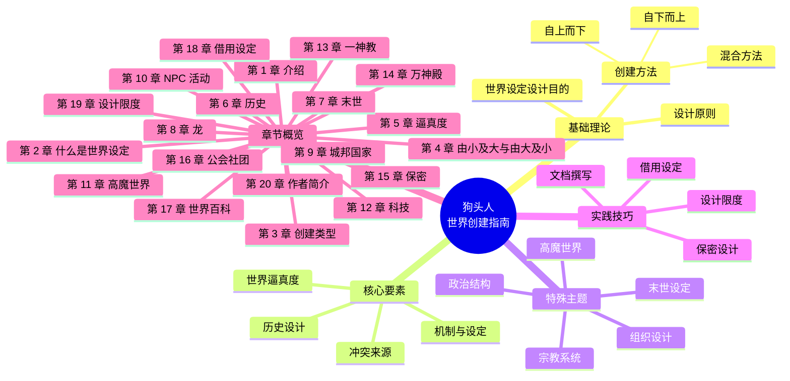

# 狗头人之世界创建指南 - 思维导图

## 核心概念

```markdown
# 狗头人之世界创建指南

## 世界设定设计的目的
- 为幻想游戏提供背景
- 提供丰富而非限制的选择
- 为英雄和坏蛋提供动机和冲突

## 设计原则
- 避免百科全书式构建
- 聚焦冲突与推动力
- 着眼当下事件
- 独立于游戏机制

## 创建方法
### 自上而下 (由大及小)
- 从宏观世界观开始
- 逐步细化到城市、人物
- 适合有明确愿景的设计师
- 控制整体叙事

### 自下而上 (由小及大)
- 从有趣场景或角色开始
- 逐步扩展到整个世界
- 适合喜欢探索的设计师
- 产生更真实有机的感觉

### 混合方法 (推荐)
- 先用自上而下确定大框架
- 再用自下而上填充细节
- 既有整体性又有丰富度

## 关键要素

### 冲突来源
- 爱情
- 战争
- 革命
- 谋杀
- 背叛
- 贪婪
- 宗教
- 压迫
- 民族自豪感

### 历史设计
- 只需极少量背景历史
- 与当前危机相关
- 避免过度解释秘密起源
- 保持简洁

### 机制与设定
- 不应过分依赖机制
- 设定推动故事
- 机制判断行动成败
- 创造地方感

## 世界逼真度
- 内部逻辑一致性最重要
- 不必完全模仿现实
- 违反内部逻辑更破坏沉浸感
- 建立 3-5 条核心规则

## 特殊主题

### 高魔世界
- 魔法规则必须清晰
- 魔法对社会的影响
- 平衡魔法与科技

### 宗教系统
- 多神教 vs 一神教
- 构建万神殿
- 宗教冲突与合作

### 政治结构
- 城邦设计
- 部落组织
- 国家体制

### 组织设计
- 公会
- 学院
- 秘密社团

### 末世设定
- 天启后世界
- 劫后余生主题
- 重建与生存

## 设计技巧

### 文档撰写
- 如何撰写世界百科
- 信息组织方式
- 可读性与实用性

### 保密设计
- 哪些信息应该隐藏
- 逐步揭示秘密
- 保持神秘感

### 借用现有设定
- 于他人庭院中嬉戏
- 改编与原创的平衡
- 尊重版权

## 设计的限度
- 不要过度设计
- 留白给游戏主持人
- 适应不同需求
- 保持灵活性
```

---

## 章节结构



---

## 使用指南

> [!tip] 使用方法
> 1. 在 Obsidian 中安装 **Mind Map** 插件
> 2. 打开此文件
> 3. 使用命令面板 (Ctrl+P) 搜索 "Mind Map: Open current file as Mind Map"
> 4. 或者右键点击文件选择 "Open as Mind Map"

> [!note] 说明
> 上面的 mermaid 代码块可以直接渲染为思维导图。如果使用 Mind Map 插件，它会将 Markdown 标题结构自动转换为思维导图。

---

## 阅读进度关联

- [[狗头人阅读笔记]] - 主笔记文件
- 已完成：第 1-2 章
- 示例章节：第 3-5 章
- 待阅读：第 6-20 章

---
